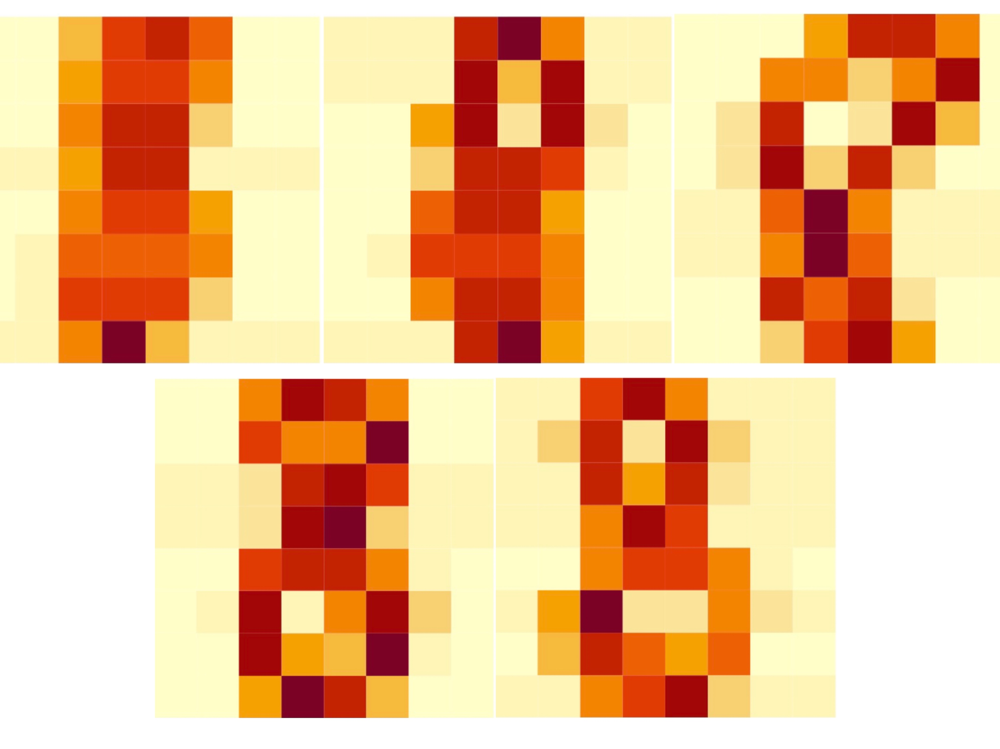

```{r setup, include=FALSE}
knitr::opts_chunk$set(echo = TRUE)
library(readr)
library(kknn)
library(ggplot2)
library(data.table)
library(glmnet)
```

## Statement of Contribution:
All assignments were completed independently by each team member and approaches/results were discussed within the group. Reports for assignments 1, 2 and 3 were produced primarily by Yiran, Shashi and Tore respectively.

## 1. Assignment 1 - Handwritten digit recognition with K-NN

### 1.1 Import data and divide it into training, validation and test sets

The first task is to import digit data and divide it into three sets for training, testing and validation respectively with 50%, 25% and 25% of the data. We use sample() with seed set as 12345.

```{r, echo = FALSE}
digits <- read.csv("optdigits.csv", header = F)
colnames(digits)[ncol(digits)] <- "number"
digits$number <- as.factor(digits$number)
n <- dim(digits)[1] 
set.seed(12345)
id <- sample(1:n, floor(n*0.5)) 
train <- digits[id,]
id1 <- setdiff(1:n, id) 
set.seed(12345) 
id2 <- sample(id1, floor(n*0.25)) 
validation <- digits[id2,]
id3 <- setdiff(id1,id2) 
test <- digits[id3,]
```


### 1.2 Train KNN model and estimate the result

This task consists of training a knn model with 30 nearest neighbors and estimate the result with confusion metrics and misclassification errors for both the training and test data. 

```{r, echo = FALSE}
knn_train <- kknn(number ~., train, train, k = 30, kernel = "rectangular")
knn_test <- kknn(number ~., train, test, k = 30, kernel = "rectangular")
pred_train<- fitted(knn_train)
confusion_train <- table(train$number, pred_train)
pred_test <- fitted(knn_test)
confusion_test <- table(test$number, pred_test)
```

The confusion matrix for train data is:

```{r, warning=FALSE, echo = FALSE}
print(confusion_train)
```

The confusion matrix for test data is:

```{r, warning=FALSE, echo = FALSE}
print(confusion_test)
```

With these two matrix, we can simply have the accuracy rate based on correct numbers over total numbers for each digits:

```{r, warning=FALSE, echo = FALSE}
print(diag(confusion_train)/rowSums(confusion_train))
print(diag(confusion_test)/rowSums(confusion_test))
```

For train data, the quality of predicting different digits is with a large range between 91% and 100%. The prediction for digit 0 is 100%, and following with 6, 2, 3 and 7 with 97% to 99% rate. While the lower ones are for digits 4, 9 and 1 with about 91% correct rate. This could indicate that for some classes with 91% accuracy rate in the train data, the model does not fit quite well.

For test data, the accuracy rates for prediction on digits do not have a huge difference than for train data. Some of them are higher than the train data prediction rate such as for 1, 6, 7 and 9. The highest one is 100% for digit 6. And other ones are below the train ones with a lowest rate for digit 4 being 86%. As we can see here, the rates for digits comparing with them for train data do not have a big difference, which means the model generalizes well and not over-fitting.

We can also have the mis-classification rate calculated as below:

```{r, warning=FALSE, echo = FALSE}
missclass <- function(X,X1) { 
  n = length(X)
  return(1-sum(diag(table(X,X1)))/n)
}
mismatch_rate_train <- missclass(train$number, pred_train)
mismatch_rate_test <- missclass(test$number, pred_test)
cat("The mismatch rate for train data is:", mismatch_rate_train, 
    "\nThe mismatch rate for test data is:", mismatch_rate_test)
```

For the overall mismatch rate 0.045 for train data and 0.053 for test data, we can see that the rates for both of them are fairly low and the difference between them is also not high. This can mean that the model is decent. But for a digit classification case with only 10 numbers, 5% error rate could mean that 1 in 20 observations would be classified wrong, which seems to be not good enough.


### 1.3 Identify and plot cases with low and high correct rates

This task is to find cases that are hard to classify and easy to classify and plot them with heatmap plots:

```{r, echo = FALSE}
train_eight <- train[which(train$number==8),]
train_eight$prob <- knn_train$prob[which(train$number==8), "8"]
sortedResult <- sort(train_eight[, "prob"], index.return = T)
#sortedResult$x[1:3] #0.1000000 0.1333333 0.1666667
hard_ids <- sortedResult$ix[1:3] #50  43 136
#tail(sortedResult$x, n=c(2)) #1 1
easy_ids <- tail(sortedResult$ix, n=c(2)) #179 183
plotHeatmap <- function(index){
  heatmap(matrix(as.numeric(train_eight[index, 1:64]), 8, 8, byrow = T), Colv = NA, Rowv = NA)
}
```
{height=30%}

The two cases of digit “8” in the training data which we found to be easiest to classify are indeed easily recognizable visually(see bottom two digits in the graphic above). Conversely, the 3 cases of digit "8" in the training data which we found to be hardest to classify are indeed difficult to recognize visually(see top three digits in the graphic above).


### 1.4 Use different knn models to fit the train data and analyze with miss-classification rate

This is about fitting the train data with K=1..30 knn models and plot the mis-classification rates for train and validation data. Then observe the plot in different perspective. The plot is shown as below: 

```{r, warning=FALSE, echo = FALSE}
e_t <- e_v <- 0
kt <- kv <- list()
for (k in 1:30) {
  kt[k] <- list(kknn(number ~., train, train, k = k, kernel = "rectangular"))
  e_t[k] <- missclass(train$number, fitted(kt[[k]]))
  kv[k] <- list(kknn(number ~., train, validation, k = k, kernel = "rectangular"))
  e_v[k] <- missclass(validation$number, fitted(kv[[k]]))
}
plot(1:30, e_v, ylim = c(0,0.06), type = "l", col = "red", xlab = "K", ylab = "miss-classification error rate", axes = FALSE)
axis(1, at = seq(1, 30, by = 1))
axis(2)
lines(1:30, e_t, ylim = c(0,0.06), col = "blue")
abline(v = 4, lty = 3)
legend(22, 0.02, legend=c("validation", "train"), col=c("red", "blue"), lty=1:1, cex=0.8)
box()
```

As k increases, model complexity decreases, and training error rate rises. But for test error rate, it goes down first until they reach a minimum value at k = 3 and k = 4, and then roughly increase there afterwards. This suggests that we have over-fitting till k = 3 or 4 and under-fitting after k > 4.

As we can see from the plot, when k = 3 or 4 (i.e. equally low bias), the model fits good. But we choose k = 4 as optimal k value since at that point the difference between training and validation error rate (a measure of the variance of the model) is lower.

From the perspective of bias-variance trade-off, the difference could be interpreted as variance and the error rate can be seen as bias. In this case, we want the bias to be as small as possible and compromise with the variance not being perfect. Low bias is not always perfect as it can lead to a higher variance(when error of train data is 0, the error of validation data is relatively higher). When bias is a little bit higher, the variance can be a bit lower as it can generalize new data better. But after certain point, when bias gets too high, the error rate for both train and validation data will be high, which would be not a suitable model as it may be under-fitting.

With the optimal K value selected based on above analysis, the result of the model for test data can be shown as:

```{r, warning=FALSE, echo = FALSE}
k_test_optik <- kknn(number ~., train, test, k = 4, kernel = "rectangular")
cat("Test mis-classification rate when k=4 is:", missclass(test$number, fitted(k_test_optik)),
    "\nTrain mis-classification rate when k=4 is:", e_t[4],
    "\nValidation mis-classification rate when k=4 is:", e_v[4])
```

The test error being 2.51% with K=4 is about the same as the error rate of validation data and a little higher (about 1.15%) higher than train data. We think the quality of the model with K=4 is acceptable because with a similar relatively high fitting rate to both validation and test data(not over-fitting) and well fitted for train data(not under-fitting).


### 1.5 Use different knn models to fit the train data and analyze with empirical risk

This task is also about fitting train data with different k values. But estimate the result with empirical risk, in this case, cross entropy value. This plot of the result is as follows:

```{r, echo = FALSE}
r_v <- r_t <- 0
for (k in 1:30) {
  s <- s2 <- 0
  for (i in 0:9) {
    s <- s + sum(log(kv[[k]]$prob[which(validation$number==i), toString(i)] + 1e-15)/nrow(kv[[k]]$prob))
    s2 <-s2 + sum(log(kt[[k]]$prob[which(train$number==i), toString(i)] + 1e-15)/nrow(kt[[k]]$prob))
  }
  r_v[k] <- -s
  r_t[k] <- -s2
}
plot(1:30, r_v, type = "l", col = "red", xlab = "K", ylab = "mean cross entropy", axes = FALSE, ylim = c(0,1))
axis(1, at = seq(1, 30, by = 1))
axis(2)
lines(1:30, r_t, col = "blue")
abline(v = 6, lty = 3)
legend(22, 0.9, legend=c("validation", "train"), col=c("red", "blue"), lty=1:1, cex=0.8)
box()
```

As the plot shows, the optimized K value is 6, because at that point, the risk value is the lowest with a value being 0.1191288. The reason cross entropy is a better approach of estimating optimal model here is because it uses the probabilities of each class for every observation. The lower the the probability the model has for the correct class, the more penalty it will get. But for the mis-classification method, it only outputs 0 or 1, which means that even if the probabilities are slightly different or huge differ from each other, the penalty would be the same. Thus, the way cross-entropy works can lead the model to be trained more correctly.


## 2. Assignment 2 - Ridge regression and model selection

### 2.1-3 Bayesian Ridge regression model, Data Prep & Functions to run Ridge regression

Bayesian ridge regression model for the data (without the intercept parameter) is: $$\mathbf{y} | \mathbb{X}, \mathbf{w} \sim N(\mathbb{X}\mathbf{w}, \, \sigma^2\mathbb{I}),$$
where:

*   $\mathbf{y}$ is the vector of Parkinson's disease symptom scores, "motor UPDRS", the dependent variable
*   $\mathbb{X}$ is the design matrix containing the observed values of all the independent variables corresponding to $\mathbf{y}$ (voice characteristics in this case)
*   $\boldsymbol{w}$ is the vector of bayesian ridge regression parameters
*   $\sigma$ is a scalar such that $\sigma^2 \cdot \mathbb{I}$ is the covariance matrix of the regression error terms

The Bayesian prior for $\boldsymbol{w}$ is: $$\mathbf{w} \sim N(0, \, \frac{\sigma^2}{\lambda}\mathbb{I}),$$

where:

*   $\lambda$ is the ridge penalty / ridge hyper-parameter

Data and functions were prepared as required (see appendix for code)

### 2.4.1 Training and test MSE values

Fitting the above mentioned ridge regression model on the training dataset, with $\lambda = 1, \, 100 \, and \, 1,000$, we see the training and test [MSE](https://en.wikipedia.org/wiki/Mean_squared_error) values as shown in the plot below. Note that the test data was scaled using the same means and standard deviations used to scale training data (this is as recommended [here](https://sebastianraschka.com/faq/docs/scale-training-test.html))

``` {r, echo = FALSE, fig.asp = 0.5}
# read in data
parkinsons <- read_csv("parkinsons.csv", col_types = cols())

# drop columns not to be used for prediction
parkinsons <- parkinsons[, -c(1, 2, 3, 4, 6)]

# bayesian model

## $$\mathbf{y} | \mathbb{X}, w_0, \mathbf{w} \sim N(w_0 + \mathbb{X}\mathbf{w}, \sigma^2\cdot \mathbb{I})$$
## $$\mathbf{w} \sim N(0, \sigma^2/\lambda \cdot \mathbb{I})$$

# create train/test partitions
all_indices <- 1:(nrow(parkinsons))
set.seed(12345)
train_indices <- sample(all_indices, ceiling(0.6*nrow(parkinsons)))
test_indices <- all_indices[!(all_indices %in% train_indices)]
train_data <- parkinsons[train_indices, ]
test_data <- parkinsons[test_indices, ]

# scale data -- see https://sebastianraschka.com/faq/docs/scale-training-test.html for why training mu/sigma are used for scaling test data
n_col <- ncol(parkinsons)
train_mu <- sapply(1:n_col, function(x) mean(unlist(train_data[x])))
train_sigma <- sapply(1:n_col, function(x) sd(unlist(train_data[x])))

train_data <- as.matrix(as.data.frame(
  sapply(1:n_col, function(x) (train_data[x] - train_mu[x])/train_sigma[x]))) # as.matrix has no effect without as.data.frame!!!
test_data <- as.matrix(as.data.frame(
  sapply(1:n_col, function(x) (test_data[x] - train_mu[x])/train_sigma[x])))

# set up helper functions

model_log_likelihood <- function(w_vector, sigma, X) { # built for no intercept models, as asked
  
  n <- nrow(X)
  term1 <- -n/2*log(2*pi*sigma^2)
  term2 <- -sum(sapply(1:n, function(x) X[x, 1] - X[x, -1] %*% w_vector)^2)/2/sigma^2 # assumes y = X[, 1]
  
  return(term1 + term2)
  
}

ridge <- function(w_vector_sigma, X, lambda) { # built for no intercept models, as asked
  
  n <- ncol(X)
  sigma <- w_vector_sigma[n]
  w_vector <- w_vector_sigma[1:(n-1)]
  return(lambda*sum(w_vector^2) - model_log_likelihood(w_vector, sigma, X))
  
}

ridge_opt <- function(X, lambda) {
  
  n <- ncol(X)
  par <- rnorm(n-1) # initial parameter values (to seed optimisation); random
  par[n] <- 1 # initialise with positive value
  return(optim(par = par, fn = ridge, method = "BFGS", X = X, lambda = lambda)$par)
  
}

degrees_of_freedom <- function(X, lambda) {
  
  mat <- tcrossprod(X %*% solve(crossprod(X) + diag(lambda, ncol(X), ncol(X))), X)
                    
  return(sum(diag(mat)))
                    
}

MSE <- function(X, optimal_weights) { # based on definition here: https://en.wikipedia.org/wiki/Mean_squared_error
  
  n <- nrow(X)
  return(sum((X[, 1] - X[, -1] %*% optimal_weights)^2)/n) # built for no-intercept models as asked
  
}

# model 1: lambda = 1
model1_optimal_weights_sigma <- ridge_opt(train_data, lambda = 1)
model1_optimal_weights <- model1_optimal_weights_sigma[1:(n_col - 1)]
model1_optimal_sigma <- model1_optimal_weights_sigma[n_col]
model1_train_MSE <- MSE(train_data, model1_optimal_weights)
model1_test_MSE <- MSE(test_data, model1_optimal_weights)
model1_train_AIC <- -2*model_log_likelihood(
  model1_optimal_weights, model1_optimal_sigma, as.matrix(train_data)) + 
  2*degrees_of_freedom(as.matrix(train_data), lambda = 1)
model1_test_AIC <- -2*model_log_likelihood(
  model1_optimal_weights, model1_optimal_sigma, as.matrix(test_data)) + 
  2*degrees_of_freedom(as.matrix(test_data), lambda = 1)


# model 2: lambda = 100
model2_optimal_weights_sigma <- ridge_opt(train_data, lambda = 100)
model2_optimal_weights <- model2_optimal_weights_sigma[1:(n_col - 1)]
model2_optimal_sigma <- model2_optimal_weights_sigma[n_col]
model2_train_MSE <- MSE(train_data, model2_optimal_weights)
model2_test_MSE <- MSE(test_data, model2_optimal_weights)
model2_train_AIC <- -2*model_log_likelihood(
  model2_optimal_weights, model2_optimal_sigma, as.matrix(train_data)) + 
  2*degrees_of_freedom(as.matrix(train_data), lambda = 100)
model2_test_AIC <- -2*model_log_likelihood(
  model2_optimal_weights, model2_optimal_sigma, as.matrix(test_data)) + 
  2*degrees_of_freedom(as.matrix(test_data), lambda = 1)

# model 3: lambda = 1000
model3_optimal_weights_sigma <- ridge_opt(train_data, lambda = 1000)
model3_optimal_weights <- model3_optimal_weights_sigma[1:(n_col - 1)]
model3_optimal_sigma <- model3_optimal_weights_sigma[n_col]
model3_train_MSE <- MSE(train_data, model3_optimal_weights)
model3_test_MSE <- MSE(test_data, model3_optimal_weights)
model3_train_AIC <- -2*model_log_likelihood(
  model3_optimal_weights, model3_optimal_sigma, as.matrix(train_data)) + 
  2*degrees_of_freedom(as.matrix(train_data), lambda = 1000)
model3_test_AIC <- -2*model_log_likelihood(
  model3_optimal_weights, model3_optimal_sigma, as.matrix(test_data)) + 
  2*degrees_of_freedom(as.matrix(test_data), lambda = 1)

# plot performance
MSE_data <- data.frame(log_10_lambda = c(0, 0, 2, 2, 3, 3), 
                       Legend = rep(c("Training", "Test"), 3), 
                       value = c(model1_train_MSE, model1_test_MSE, model2_train_MSE, 
                                 model2_test_MSE, model3_train_MSE, model3_test_MSE))

ggplot(MSE_data) + geom_line(aes(log_10_lambda, value, colour = Legend)) +
  theme_bw() + geom_label(aes(log_10_lambda, value, label = round(value, 4))) + 
  geom_vline(xintercept = 2, linetype = "dotted") + 
  xlab("Log (base-10) of Hyper-Parameter 'lambda'") + ylab("Mean Squared Error") + 
  ggtitle("Finding the Optimal Hyper-Parameter")
```

### 2.4.2 Most appropriate value of penalty parameter lambda

We can see that the optimal value of $\lambda$ within the set $\{1, 100, 1000\}$ is 100. At $\lambda = 1$, there is overfitting, evidenced by low training error and large test error; at $\lambda = 1000$, on the other hand, there is underfitting, evidenced by high training and test error.

### 2.4.3 MSE is a more appropriate measure here than other empirical risk functions

MSE is a more appropriate measure here than other empirical risk functions such as MAE (mean absolute error), because in regression problems, MSE can, unlike MAE and similar measures, also serve as an estimator of the variance of the error terms. Such an estimate would be useful in validating the underlying assumptions of a regression model (such as independence of error terms). Of course empirical risk functions such as mis-classification rate or cross-entropy do not apply in regression problems such as this, making MSE more appropriate than such measures.

### 2.5.1 Optimal model according to AIC criterion

In terms of AIC, we consider the optimal value of $\lambda$ within the set $\{1, 100, 1000\}$ to be 1, as opposed to 100, which was the optimal value found via the holdout method. Note that even though it is not strictly required, we review AIC in both training and test samples. 

If we review the first plot below, at value $\lambda = 1$, test AIC is low (though not at it's lowest), training AIC is at its lowest, and the difference between test AIC and training AIC is at its lowest as well. However, it's clearer from the second plot, that AIC (when normalised for the number of observations in the training/test datasets) is lowest when $\lambda = 1$, both for training and test datasets.

Note that we calculate degrees of freedom according to Equation 3.50 in the book The Elements of Statistical Learning, Hastie et al, Second Edition, Springer, in page 68.

### 2.5.2 Theoretical advantage of AIC based model selection compared to holdout model selection

The theoretical advantage of using AIC for model selection is that it can perform 'in-sample' model selection. That is, it does not require a holdout sample for model selection. This is advantageous in situations where there are only enough observations to train the model. For instance, if there were only 30 observations of data in all, it would be ill-advised to split the data into training and holdout samples; instead one should use all the available data for model training.

Note that AIC of any given model is influenced both by data likelihood (given the model) and its degrees of freedom. In the plot below, we see evidence of AIC being dominated by the likelihood factor and as a result, we end up selecting the model with $\lambda = 1$ as the optimal model, since it has lowest normalised AIC, even though that model is the most complex of the three models with $\lambda = 1, \, 100, \, and \, 1000$ respectively.

``` {r, echo = FALSE, fig.asp = 0.5}
AIC_data <- data.frame(log_10_lambda = c(0, 0, 2, 2, 3, 3), 
                       Legend = rep(c("Training", "Test"), 3),
                       value = c(model1_train_AIC, model1_test_AIC, model2_train_AIC,
                                 model2_test_AIC, model3_train_AIC, model3_test_AIC),
                       value_norm = c(model1_train_AIC/nrow(train_data),
                                 model1_test_AIC/nrow(train_data),
                                 model2_train_AIC/nrow(train_data),
                                 model2_test_AIC/nrow(test_data),
                                 model3_train_AIC/nrow(test_data),
                                 model3_test_AIC/nrow(test_data)))

ggplot(AIC_data) + geom_line(aes(log_10_lambda, value, colour = Legend)) + 
  geom_vline(xintercept = 0, linetype = "dotted") + theme_bw() + 
  geom_label(aes(log_10_lambda, value, label = round(value, 0)), label.size = 0.1) +
  xlab("Log (base-10) of Hyper-Parameter 'lambda'") + 
  ylab("Model AIC (without any normalisation)") + 
  ggtitle("Finding the Optimal Hyper-Parameter")

ggplot(AIC_data) + geom_line(aes(log_10_lambda, value_norm, colour = Legend)) + 
  geom_vline(xintercept = 0, linetype = "dotted") + theme_bw() + 
  geom_label(aes(log_10_lambda, value_norm, label = round(value_norm, 2)), label.size = 0.1) +
  xlab("Log (base-10) of Hyper-Parameter 'lambda'") + 
  ylab("Model AIC normalised \nfor number of observations") + 
  ggtitle("Finding the Optimal Hyper-Parameter")
```


## Assignment 3: Linear regression and LASSO

### 3.1

```{r, echo=FALSE}

# Reading in data and diving into training and test set

fats <- read.csv("tecator.csv", row.names = 1)
fats <- fats[, -c(102,103)]
set.seed(12345)
n3 <- nrow(fats)
id_fat_train <- sample(1:n3, floor(n3*0.5))
id_fat_test <- setdiff(1:n3, id_fat_train)

train_fat <- fats[id_fat_train,]
test_fat <- fats[id_fat_test,]
```

The underlying problistic model is a linear regression model with the distribution $$y \sim N (w^T\mathcal{X}, \, \sigma^2)$$

* y is a vector of the response variable "Fat" 
* $w^T$ is a vector of the regression parameters 
* $\mathcal{X}$ is a matrix of the observed values for the independent variables used in the model which are the fat channels
* $\sigma^2$ is a scalar that denotes the variance of the features.

```{r,echo =FALSE}

# 3.1

train_fat <- as.data.frame(train_fat)
test_fat<-as.data.frame(test_fat)
lm_fats_train <- lm(Fat ~., data = train_fat )

sum_mary<-summary(lm_fats_train)
#predictions 
predicted_train_fat <- predict(lm_fats_train)

#train MSE
mse_train <- mean((train_fat$Fat - predicted_train_fat)^2)

predicted_test_fat<-predict(lm_fats_train, test_fat)

#test MSE
mse_test <- mean((test_fat$Fat- predicted_test_fat)^2)

cat("Output of the linear regression model: \n")
cat("Training MSE: ", mse_train, ", Test MSE: ", mse_test,"\n")
cat("Adjusted R-square: ", sum_mary$adj.r.squared)

```


With the very low training MSE and comparably high test MSE we have reason to believe that there is overfitting occurring with the model. From viewing the summary for the training model it was found to give a adjusted R-square of 0.9994% which gives an clear indication that the model is overfit.

```{r, echo=FALSE, warning= FALSE}
# Plotting the linear regression model

par(mfrow = c(2,2))

plot(lm_fats_train)

```


Analyzing the plots we find that the assumption that the model residuals are i.i.d does seems to be fulfilled. From the residual vs fitted plot it can be observed that the assumption for constant variance is not fulfilled with a wider spread on the left hand side compared to the right hand side. It's clear that the residuals do not follow anything similar to a normal distribution with mean 0 and constant variance when observing the QQ-plot. Hence the assumptions for the model are not fulfilled so we should not draw any conclusions from the model.


### 3.2

The function we are looking to optimize in this case is loss function of the LASSO model.


$$\sum\limits_{i=1}^N{(y_i - \mathbb{X}_i\boldsymbol{\beta})^2} + \lambda\sum\limits_{j=1}^p{|\beta_j|}$$

Where $N$ is the number of observations and $\mathbb{X}$ is the matrix of features and $y$ is the dependent variable. $\beta$ are the parameters that the shrinkage function will choose so that the loss function minimizes. With $\lambda$ being the shrinkage parameter and P the number of features. Where the chosen $\lambda$ will shrink the $\beta$ parameters. 

### 3.3
```{r, echo=FALSE, fig.asp = 0.5}

# 3.3

x<-as.matrix(train_fat[,c(1:100)])
y <- as.matrix(train_fat[,101])

# Creating a sequence of lambda values to numerically test where 3 features
# will be found 

lambda_values<-seq(from = 0.01, to = 1, by = 0.002)
lambda_values<-rev(lambda_values)
lasso3_3_df <- 0
i <- 1

#Finding where we get 3 parameters numerically
while(lasso3_3_df < 3){

lasso3_3 <- glmnet(x = x, y = y, alpha = 1, lambda = lambda_values[i])

lasso3_3_df <-   lasso3_3$df
i = i+1
}

# The resulting lambda value


lasso3_3_for_plot<-glmnet(x = x, y = y, alpha = 1)

plot(lasso3_3_for_plot, xvar = "lambda" , main = "LASSO model coefficent convergence")


cat("The approximate upper bound for 3 features: ", log(lambda_values[i]))

```

From the plot we can see that where the function converges to 3 features that have non zero coefficients is approximately at $log(\lambda) = -0.2$ and it was numerically shown that the upper bound approximately to be at $log(\lambda) = -0.1031408$ where the function would have a DF of 3 and 3 features with non zero coefficients. Approximately between the values  $log(\lambda) = (-0.5,-0.1031408)$ the model will have 3 features. 

### 3.4

```{r, echo=FALSE, fig.asp = 0.5}

# Plotting degrees of freedom for LASSO model

plot_data <- data.frame("log_lambda" = log(lasso3_3_for_plot$lambda), "df" = lasso3_3_for_plot$df )
ggplot(data = plot_data ,aes( x= log_lambda , y = df)) + geom_point() + 
  labs(title = "Degrees of freedom vs Log lambda", x = "Log lambda", y = "Degrees of freedom")

```

The graph shows that as the value of the shrinkage parameter lambda increases it reduces the number of features in the model. Which is exactly as expected from the given function with an sufficiently large $\lambda$ it will reduce the number of features included to 0 as such decreasing the degrees of freedom. 

### 3.5

```{r, echo=FALSE, fig.asp = 0.5}
# 3.5

lasso3_5_for_plot<-glmnet(x = x, y = y, alpha = 0)

plot(lasso3_3_for_plot, "lambda", main = "Lasso regression: Coef vs log lambda")
plot(lasso3_5_for_plot, "lambda", main = "Ridge regression: Coef vs log Lambda")
```

As seen in the graphs the lasso function will converge the coefficients of the model to 0 whereas the ridge regression model will reduce the coefficients close to zero but never to zero.

\newpage

### 3.6

```{r, echo=FALSE}

# 3.6

# cross validation with 3 folds
set.seed(12345)
cv_lasso <- cv.glmnet(x = x, y = y, alpha = 1, nfolds = 3)


# Finding out what the optimal models DF is
lasso3_6_opt <- glmnet(x = x, y = y, alpha = 1, lambda = cv_lasso$lambda.min)


#We find that 7 variables were used in the 

# Finding out the DF of the 
lambda_test<-exp(-2)
lasso3_6_lambda_chosen <- glmnet(x = x, y = y, alpha = 1, lambda = lambda_test)


#Finding the uppbound of CV-MSE-CI and plotting

min_lambda<-as.numeric(which(cv_lasso$lambda.min==cv_lasso$lambda))
point_upper_limit_of_CI<-cv_lasso$cvup[min_lambda]
plot(cv_lasso, main = "Cross-validation 3 fold CI:s for MSE vs values of lambda")
abline(h = point_upper_limit_of_CI)


cat("DF for log lambda = -2: ", lasso3_6_lambda_chosen$df, "\n")
cat("DF for opitmal lambda found through CV: ", lasso3_6_opt$df )

```
The graph shows that the lowest MSE is found at $\lambda = 0.04769214$ which is at $log(\lambda) = -3.042989$ as shown in the graph. As the $log(\lambda)$ increases the MSE will increase with a linear rate from -5 to approx -2.5 and then with a non-linear increase until approximately $log(\lambda)$ reaches 0 and then where it will slowdown the increasing rate of MSE.

From the cross-validation (CV) plot with the help of the black horizontal line where it goes from the upper bound of the confidence interval of the MSE for optimal lambda. As the black line crosses within the confidence interval of the $log(\lambda) = -2$, which means that it's not possible to conclude that the optimal lambda is significantly better than the $log(\lambda) = -2$. The number of folds used for CV was 3 as to trying to reach a reasonable amount of observations used in the validation set used for CV. As the number of observations is only 107 in the train set with CV k-fold = 3 gives over 35 observations in each fold instead of the 20+ in k-fold = 5. 


```{r, echo = FALSE, fig.asp = 0.5}


#plotting predicted vs observed values
y_hat_lasso <-predict(lasso3_6_opt, as.matrix(test_fat[,-101]))

plot_data_36 <- data.frame("y_test" = test_fat[,101] , "ylassopred" = y_hat_lasso)

ggplot(plot_data_36, aes(x = y_test, y = s0)) + geom_point() + labs(title = "Comparison of Predicted values with LASSO optimal vs \n observed values from the test data", x = "y from test data", y = "Predicted values from LASSO")
```

From observing the plot we can say that the predictions are a decent estimate as a perfect fit would results in a diagonal line over the graph. There seems to be a approximately linear trend between the predictions and true values. The model seem to estimate both higher and lower values with no clear trend in one direction.


### 3.7

```{r, echo= FALSE, fig.asp = 0.5}

# 3.7

#Predicting from lasso lambda opt
preds <- predict(lasso3_6_opt,as.matrix( test_fat[,-101]))

#calculating new sigma
sigma<- sd((train_fat[,101] - predict(lasso3_6_opt,as.matrix(train_fat[,-101])) ))

#generating new data
set.seed(12345)
new_targets <- rnorm(n = nrow(test_fat),preds, sigma)

generated_data <- data.frame("ytest" = test_fat[,101], "generated" = new_targets )
ggplot(generated_data, aes(x = ytest, y = generated)) + geom_point()+
  labs(title = "Generated data vs observed test data", x = "y from test data", y = "Generated data")


```

The generated data has a larger spread than the predicted data which is reasonable with the noise included from the residuals. The generated data it self is not good as it comes from a discriminative model instead of a generative model which would produce more random outcomes for the target values. Which is why the generated data closely follows the same distribution as the observed with increased variance.


## Appendix: Code

``` {r, eval = FALSE}
library(readr)
library(kknn)
library(ggplot2)
library(data.table)
library(glmnet)

#Assignment 1
#1.1
digits <- read.csv("optdigits.csv", header = F)
colnames(digits)[ncol(digits)] <- "number"
digits$number <- as.factor(digits$number)
n <- dim(digits)[1] 
set.seed(12345)
id <- sample(1:n, floor(n*0.5)) 
train <- digits[id,]
id1 <- setdiff(1:n, id) 
set.seed(12345) 
id2 <- sample(id1, floor(n*0.25)) 
validation <- digits[id2,]
id3 <- setdiff(id1,id2) 
test <- digits[id3,]

#1.2
knn_train <- kknn(number ~., train, train, k = 30, kernel = "rectangular")
knn_test <- kknn(number ~., train, test, k = 30, kernel = "rectangular")
#Confusion matrix
pred_train<- fitted(knn_train)
confusion_train <- table(train$number, pred_train)
pred_test <- fitted(knn_test)
confusion_test <- table(test$number, pred_test)
print(confusion_train)
print(confusion_test)
print(diag(confusion_train)/rowSums(confusion_train))
print(diag(confusion_test)/rowSums(confusion_test))
#Misclassification errors
missclass <- function(X,X1) { 
  n = length(X)
  return(1-sum(diag(table(X,X1)))/n)
}
mismatch_rate_train <- missclass(train$number, pred_train) #0.04500262
mismatch_rate_test <- missclass(test$number, pred_test) #0.05329154
cat("The mismatch rate for train data is:", mismatch_rate_train, 
    "\nThe mismatch rate for test data is:", mismatch_rate_test)

#1.3
train_eight <- train[which(train$number==8),]
train_eight$prob <- knn_train$prob[which(train$number==8), "8"]
sortedResult <- sort(train_eight[, "prob"], index.return = T)
sortedResult$x[1:3] #0.1000000 0.1333333 0.1666667
hard_ids <- sortedResult$ix[1:3] #50  43 136
tail(sortedResult$x, n=c(2)) #1 1
easy_ids <- tail(sortedResult$ix, n=c(2)) #179 183
plotHeatmap <- function(index){
  heatmap(matrix(as.numeric(train_eight[index, 1:64]), 8, 8, byrow = T), Colv = NA, Rowv = NA)
}
for (i in c(hard_ids, easy_ids)) {
  plotHeatmap(i)
}

#1.4
e_t <- e_v <- 0
kt <- kv <- list()
for (k in 1:30) {
  kt[k] <- list(kknn(number ~., train, train, k = k, kernel = "rectangular"))
  e_t[k] <- missclass(train$number, fitted(kt[[k]]))
  kv[k] <- list(kknn(number ~., train, validation, k = k, kernel = "rectangular"))
  e_v[k] <- missclass(validation$number, fitted(kv[[k]]))
}
plot(1:30, e_v, ylim = c(0,0.06), type = "l", col = "red", xlab = "K", ylab = "miss-classification error rate", axes = FALSE)
axis(1, at = seq(1, 30, by = 1))
axis(2)
lines(1:30, e_t, ylim = c(0,0.06), col = "blue")
abline(v = 4, lty = 3)
legend(22, 0.02, legend=c("validation", "train"), col=c("red", "blue"), lty=1:1, cex=0.8)
box()

k_test_optik <- kknn(number ~., train, test, k = 4, kernel = "rectangular")
cat("Test mis-classification rate when k=4 is:", missclass(test$number, fitted(k_test_optik)),
    "\nTrain mis-classification rate when k=4 is:", e_t[4],
    "\nValidation mis-classification rate when k=4 is:", e_v[4])

#1.5
r_v <- r_t <- 0
for (k in 1:30) {
  s <- s2 <- 0
  for (i in 0:9) {
    s <- s + sum(log(kv[[k]]$prob[which(validation$number==i), toString(i)] + 1e-15)/nrow(kv[[k]]$prob))
    s2 <-s2 + sum(log(kt[[k]]$prob[which(train$number==i), toString(i)] + 1e-15)/nrow(kt[[k]]$prob))
  }
  r_v[k] <- -s
  r_t[k] <- -s2
}
plot(1:30, r_v, type = "l", col = "red", xlab = "K", ylab = "mean cross entropy", axes = FALSE, ylim = c(0,1))
axis(1, at = seq(1, 30, by = 1))
axis(2)
lines(1:30, r_t, col = "blue")
abline(v = 6, lty = 3)
legend(22, 0.9, legend=c("validation", "train"), col=c("red", "blue"), lty=1:1, cex=0.8)
box()


### Assignment 2

# read in data
parkinsons <- read_csv("parkinsons.csv", col_types = cols())

# drop columns not to be used for prediction
parkinsons <- parkinsons[, -c(1, 2, 3, 4, 6)]

# bayesian model

## $$\mathbf{y} | \mathbb{X}, w_0, \mathbf{w} \sim N(w_0 +
## \mathbb{X}\mathbf{w}, \sigma^2\cdot \mathbb{I})$$
## $$\mathbf{w} \sim N(0, \sigma^2/\lambda \cdot \mathbb{I})$$

# create train/test partitions
all_indices <- 1:(nrow(parkinsons))
set.seed(12345)
train_indices <- sample(all_indices, ceiling(0.6*nrow(parkinsons)))
test_indices <- all_indices[!(all_indices %in% train_indices)]
train_data <- parkinsons[train_indices, ]
test_data <- parkinsons[test_indices, ]

# scale data -- see https://sebastianraschka.com/faq/docs/scale-training-test.html
# for why training mu/sigma are used for scaling test data
n_col <- ncol(parkinsons)
train_mu <- sapply(1:n_col, function(x) mean(unlist(train_data[x])))
train_sigma <- sapply(1:n_col, function(x) sd(unlist(train_data[x])))

train_data <- as.matrix(as.data.frame(
  sapply(1:n_col, function(x) (train_data[x] - train_mu[x])/train_sigma[x])))
# as.matrix has no effect without as.data.frame!!!
test_data <- as.matrix(as.data.frame(
  sapply(1:n_col, function(x) (test_data[x] - train_mu[x])/train_sigma[x])))

# set up helper functions

model_log_likelihood <- function(w_vector, sigma, X) { 
  # built for no intercept models, as asked
  
  n <- nrow(X)
  term1 <- -n/2*log(2*pi*sigma^2)
  term2 <- -sum(sapply(1:n, function(x) X[x, 1] - X[x, -1] %*% w_vector)^2)/2/sigma^2
  # assumes y = X[, 1]
  
  return(term1 + term2)
  
}

ridge <- function(w_vector_sigma, X, lambda) { 
  # built for no intercept models, as asked
  
  n <- ncol(X)
  sigma <- w_vector_sigma[n]
  w_vector <- w_vector_sigma[1:(n-1)]
  return(lambda*sum(w_vector^2) - model_log_likelihood(w_vector, sigma, X))
  
}

ridge_opt <- function(X, lambda) {
  
  n <- ncol(X)
  par <- rnorm(n-1) # initial parameter values (to seed optimisation); random
  par[n] <- 1 # initialise with positive value
  return(optim(par = par, fn = ridge, method = "BFGS", X = X, lambda = lambda)$par)
  
}

degrees_of_freedom <- function(X, lambda) {
  
  mat <- tcrossprod(X %*% solve(crossprod(X) + diag(lambda, ncol(X), ncol(X))), X)
                    
  return(sum(diag(mat)))
                    
}

MSE <- function(X, optimal_weights) { # based on definition here:
  # https://en.wikipedia.org/wiki/Mean_squared_error
  
  n <- nrow(X)
  return(sum((X[, 1] - X[, -1] %*% optimal_weights)^2)/n) 
  # built for no-intercept models as asked
  
}

model1_optimal_weights_sigma <- ridge_opt(train_data, lambda = 1)
model1_optimal_weights <- model1_optimal_weights_sigma[1:(n_col - 1)]
model1_optimal_sigma <- model1_optimal_weights_sigma[n_col]
model1_train_MSE <- MSE(train_data, model1_optimal_weights)
model1_test_MSE <- MSE(test_data, model1_optimal_weights)
model1_train_AIC <- -2*model_log_likelihood(
  model1_optimal_weights, model1_optimal_sigma, as.matrix(train_data)) + 
  2*degrees_of_freedom(as.matrix(train_data), lambda = 1)
model1_test_AIC <- -2*model_log_likelihood(
  model1_optimal_weights, model1_optimal_sigma, as.matrix(test_data)) + 
  2*degrees_of_freedom(as.matrix(test_data), lambda = 1)


# model 2: lambda = 100
model2_optimal_weights_sigma <- ridge_opt(train_data, lambda = 100)
model2_optimal_weights <- model2_optimal_weights_sigma[1:(n_col - 1)]
model2_optimal_sigma <- model2_optimal_weights_sigma[n_col]
model2_train_MSE <- MSE(train_data, model2_optimal_weights)
model2_test_MSE <- MSE(test_data, model2_optimal_weights)
model2_train_AIC <- -2*model_log_likelihood(
  model2_optimal_weights, model2_optimal_sigma, as.matrix(train_data)) + 
  2*degrees_of_freedom(as.matrix(train_data), lambda = 100)
model2_test_AIC <- -2*model_log_likelihood(
  model2_optimal_weights, model2_optimal_sigma, as.matrix(test_data)) + 
  2*degrees_of_freedom(as.matrix(test_data), lambda = 1)

# model 3: lambda = 1000
model3_optimal_weights_sigma <- ridge_opt(train_data, lambda = 1000)
model3_optimal_weights <- model3_optimal_weights_sigma[1:(n_col - 1)]
model3_optimal_sigma <- model3_optimal_weights_sigma[n_col]
model3_train_MSE <- MSE(train_data, model3_optimal_weights)
model3_test_MSE <- MSE(test_data, model3_optimal_weights)
model3_train_AIC <- -2*model_log_likelihood(
  model3_optimal_weights, model3_optimal_sigma, as.matrix(train_data)) + 
  2*degrees_of_freedom(as.matrix(train_data), lambda = 1000)
model3_test_AIC <- -2*model_log_likelihood(
  model3_optimal_weights, model3_optimal_sigma, as.matrix(test_data)) + 
  2*degrees_of_freedom(as.matrix(test_data), lambda = 1)

# plot performance
MSE_data <- data.frame(log_10_lambda = c(0, 0, 2, 2, 3, 3), 
                       Legend = rep(c("Training", "Test"), 3), 
                       value = c(model1_train_MSE, model1_test_MSE, model2_train_MSE, 
                                 model2_test_MSE, model3_train_MSE, model3_test_MSE))

ggplot(MSE_data) + geom_line(aes(log_10_lambda, value, colour = Legend)) + theme_bw() + 
  geom_vline(xintercept = 2, linetype = "dotted") + 
  xlab("Log (base-10) of Hyper-Parameter 'lambda'") + ylab("Mean Squared Error") + 
  ggtitle("Finding the Optimal Hyper-Parameter")

AIC_data <- data.frame(log_10_lambda = c(0, 0, 2, 2, 3, 3), 
                       Legend = rep(c("Training", "Test"), 3),
                       value = c(model1_train_AIC, model1_test_AIC, model2_train_AIC,
                                 model2_test_AIC, model3_train_AIC, model3_test_AIC),
                       value_norm = c(model1_train_AIC/nrow(train_data),
                                 model1_test_AIC/nrow(train_data),
                                 model2_train_AIC/nrow(train_data),
                                 model2_test_AIC/nrow(test_data),
                                 model3_train_AIC/nrow(test_data),
                                 model3_test_AIC/nrow(test_data)))

ggplot(AIC_data) + geom_line(aes(log_10_lambda, value, colour = Legend)) + 
  geom_vline(xintercept = 0, linetype = "dotted") + theme_bw() + 
  geom_label(aes(log_10_lambda, value, label = round(value, 0)), label.size = 0.1) +
  xlab("Log (base-10) of Hyper-Parameter 'lambda'") + 
  ylab("Model AIC (without any normalisation)") + 
  ggtitle("Finding the Optimal Hyper-Parameter")

ggplot(AIC_data) + geom_line(aes(log_10_lambda, value_norm, colour = Legend)) + 
  geom_vline(xintercept = 0, linetype = "dotted") + theme_bw() + 
  geom_label(aes(log_10_lambda, value_norm, label = round(value_norm, 2)), label.size = 0.1) +
  xlab("Log (base-10) of Hyper-Parameter 'lambda'") + 
  ylab("Model AIC normalised for number of observations") + 
  ggtitle("Finding the Optimal Hyper-Parameter")

### Question 3

# Reading in data and diving into training and test set

fats <- read.csv("tecator.csv", row.names = 1)
fats <- fats[, -c(102,103)]
set.seed(12345)
n3 <- nrow(fats)
id_fat_train <- sample(1:n3, floor(n3*0.5))
id_fat_test <- setdiff(1:n3, id_fat_train)

train_fat <- fats[id_fat_train,]
test_fat <- fats[id_fat_test,]


# 3.1

train_fat <- as.data.frame(train_fat)
test_fat<-as.data.frame(test_fat)
lm_fats_train <- lm(Fat ~., data = train_fat )

sum_mary<-summary(lm_fats_train)
#predictions 
predicted_train_fat <- predict(lm_fats_train)

#train MSE
mse_train <- mean((train_fat$Fat - predicted_train_fat)^2)

predicted_test_fat<-predict(lm_fats_train, test_fat)

#test MSE
mse_test <- mean((test_fat$Fat- predicted_test_fat)^2)

cat("Training MSE: ", mse_train, ". Test MSE: ", mse_test,"\n")
cat("Adjusted R-square: ", sum_mary$adj.r.squared)


# Plotting the linear regression model

par(mfrow = c(2,2))

plot(lm_fats_train)

# 3.3

x<-as.matrix(train_fat[,c(1:100)])
y <- as.matrix(train_fat[,101])

# Creating a sequence of lambda values to numerically test where 3 features
# will be found 

lambda_values<-seq(from = 0.01, to = 1, by = 0.002)
lambda_values<-rev(lambda_values)
lasso3_3_df <- 0
i <- 1

#Finding where we get 3 parameters numerically
while(lasso3_3_df < 3){

lasso3_3 <- glmnet(x = x, y = y, alpha = 1, lambda = lambda_values[i])

lasso3_3_df <-   lasso3_3$df
i = i+1
}

# The resulting lambda value
log(lambda_values[i])


lasso3_3_for_plot<-glmnet(x = x, y = y, alpha = 1)

plot(lasso3_3_for_plot, "lambda" , main = "LASSO model coefficent convergence")

# 3.4

# Plotting degrees of freedom for LASSO model

plot_data <- data.frame("log_lambda" = log(lasso3_3_for_plot$lambda), "df" = lasso3_3_for_plot$df )
ggplot(data = plot_data ,aes( x= log_lambda , y = df)) + geom_point() + 
  labs(title = "Degrees of freedom vs Log lambda", x = "Log lambda", y = "Degrees of freedom")

# 3.5

lasso3_5_for_plot<-glmnet(x = x, y = y, alpha = 0)

plot(lasso3_3_for_plot, "lambda", main = "Lasso regression: Coef vs log lambda")
plot(lasso3_5_for_plot, "lambda", main = "Ridge regression: Coef vs log Lambda")


# 3.6

# cross validation with 10 folds
set.seed(12345)
cv_lasso <- cv.glmnet(x = x, y = y, alpha = 1)


# Finding out what the optimal models DF is
lasso3_6_opt <- glmnet(x = x, y = y, alpha = 1, lambda = cv_lasso$lambda.min)


#We find that 7 variables were used in the 

# Finding out the DF of the 
lambda_test<-exp(-2)
lasso3_6_lambda_chosen <- glmnet(x = x, y = y, alpha = 1, lambda = lambda_test)


cat("DF for log lambda = -2: ", lasso3_6_lambda_chosen$df, "\n")
cat("DF for opitmal lambda found through CV: ", lasso3_6_opt$df )

#Finding the uppbound of CV-MSE-CI and plotting

min_lambda<-as.numeric(which(cv_lasso$lambda.min==cv_lasso$lambda))
point_upper_limit_of_CI<-cv_lasso$cvup[min_lambda]
plot(cv_lasso, main = "Cross-validation 10 fold CI:s for MSE vs values of lambda")
abline(h = point_upper_limit_of_CI)


#plotting predicted vs observed values

y_hat_lasso <-predict(lasso3_6_opt, as.matrix(test_fat[,-101]))

plot_data_36 <- data.frame("y_test" = test_fat[,101] , "ylassopred" = y_hat_lasso)

ggplot(plot_data_36, aes(x = y_test, y = s0)) + geom_point() + labs(title = "Comparison of Predicted values with LASSO optimal vs \n observed values from the test data", x = "y from test data", y = "Predicted values from LASSO")


# 3.7

#Predicting from lasso lambda opt
preds <- predict(lasso3_6_opt,as.matrix( test_fat[,-101]))

#calculating new sigma
sigma<- sd((train_fat[,101] - predict(lasso3_6_opt,as.matrix(train_fat[,-101])) ))

#generating new data
set.seed(12345)
new_targets <- rnorm(n = nrow(test_fat),preds, sigma)

generated_data <- data.frame("ytest" = test_fat[,101], "generated" = new_targets )
ggplot(generated_data, aes(x = ytest, y = generated)) + geom_point()+
  labs(title = "Generated data vs observed test data", x = "y from test data", y = "Generated data")


```